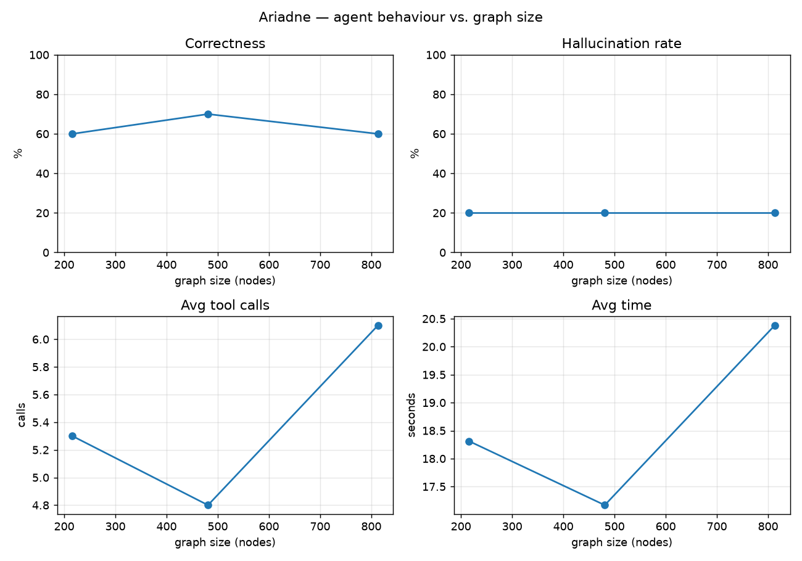

# Ariadne

**Can an LLM agent trace an Active Directory attack path to Domain Admin on its own — and how does it compare to BloodHound?**

Ariadne is a small, reproducible benchmark that drops a language-model agent into a graph of Active Directory (AD) misconfigurations and asks it to find a privilege-escalation path from a low-privilege account to **Domain Admin**, using only a handful of graph-query tools — exactly the exploration a human analyst does by hand in BloodHound. Every run is scored against a ground-truth shortest path, so we can measure how often the agent is *right*, how often it *hallucinates* an edge that doesn't exist, and how all of this changes as the graph grows.

> In the myth, Ariadne's thread is what lets Theseus find his way back out of the labyrinth. Here it's the question of whether an LLM can trace its own thread through the tangled graph of an AD forest.

No Windows lab required: the AD graph is generated **synthetically** in the BloodHound schema, straight into Neo4j. The agent can't tell it from a real SharpHound collection, because the structure is identical.

---

## Results

A sweep with `openai/gpt-4o-mini` (temperature 0), 30 runs across three graph sizes (7 planted + 3 random starts each). Advanced steps here are **inferred from properties**, not edges (see below):

| Nodes | Correctness | Hallucination | Beats BH | Avg tool calls | Avg time |
| ---: | ---: | ---: | ---: | ---: | ---: |
| 216 | 60.0% | 20.0% | 1 | 5.3 | 18.3s |
| 481 | 70.0% | 20.0% | 1 | 4.8 | 17.2s |
| 813 | 60.0% | 20.0% | 1 | 6.1 | 20.4s |



Overall: **63.3% correct**, every real path it finds is the **shortest one** (19/19 optimal), at about **$0.001/run**. Three findings stand out:

- **It finds paths BloodHound's rule-based query structurally can't — but only sometimes.** On the 9 cases reachable *only* through an inferred step, the agent found a real path **3 times** (one at every size), for **33% advanced-case recall**. Every win was the unconstrained-delegation inference (read the host's property → step to Domain Admins). It reliably *fails* the multi-hop kerberoast chain: it explores it correctly but drops the roasted-account node from its final path, so the verifier rejects it. That split — direct inference solved, multi-hop inference not — is the honest headline, and a concrete argument for a stronger model.
- **Correctness holds roughly flat with size** (60–70%), not collapsing — the 20-step budget and forced name→id resolution keep it from starving on larger graphs; step-exhaustion is ~0 in the failure breakdown.
- **When it's wrong it fabricates rather than folds** (~20% hallucination), largely the failed roast attempts producing an invalid hop. Forcing a `check_path_exists` confirmation before finishing is the clearest next lever.

Reproduce with `python experiments/run_benchmark.py` (see [Quickstart](#quickstart)). Full numbers, per-size table, and failure-mode breakdown in [`results/metrics.md`](results/metrics.md). *(Small sample — 30 runs, single model, temperature 0; treat as a pilot.)*

---

## How it works

```
 data/generator/            src/ariadne/tools/      src/ariadne/agent/       src/ariadne/evaluation/
 seeded generator  ──►  Neo4j  ──►  4 query tools  ──►  ReAct loop (LLM)  ──►  hop-by-hop scoring
 (BloodHound schema)     graph                          reason→act→observe     + metrics + plots
                           │
                           └──►  ground-truth shortest path (Cypher)  =  BloodHound-equivalent baseline
```

The agent is **never shown the whole graph as text** — that would reduce the task to pattern-matching. It gets five tools and must explore:

| Tool | What it returns |
| --- | --- |
| `search_node(name_or_type)` | Resolve a user/group/computer by name or label to its object id |
| `query_outbound_edges(node)` | What this object can control / reach (`GenericAll`, `MemberOf`, `ForceChangePassword`, …) |
| `query_inbound_edges(node)` | What can control / reach this object |
| `get_node_properties(node)` | A node's **properties** — some enable *inferred* steps that are not edges |
| `check_path_exists(start, end)` | Whether a canonical-edge chain exists in the graph |

It runs a minimal **ReAct loop** (reason → call a tool → observe → repeat) and finishes by proposing an ordered attack path. Scoring then verifies that path **hop by hop** against Neo4j: every claimed hop must be a real edge *or* a property-justified inferred step reaching Domain Admins, or it's counted as a hallucination.

**Edges vs. inference — where the agent can *genuinely* beat BloodHound.** The graph contains only *canonical* BloodHound edges (`MemberOf`, `GenericAll`, `ForceChangePassword`, …) — exactly what BloodHound's classic "shortest path to Domain Admins" query traverses, our rule-based baseline. Advanced tradecraft is deliberately **not** an edge: a kerberoastable service account is a `hasspn`+`crackable` **property**; an unconstrained-delegation host is an `unconstraineddelegation` **property**. A pure shortest-path query *structurally cannot* follow those steps — there is no edge to follow — but an agent that reads a node's properties can infer them, and the verifier accepts the step only if the property justifies it. When the agent's verified path uses such an inferred step and the canonical query finds nothing, it **`beats_bloodhound`** — and, crucially, that gap can't be closed by adding one edge type to the baseline's filter, because the step isn't in the collected graph at all. That is the honest version of the claim.

### The verified reader: checks + a grounded chat assistant

The same engine drives a practical layer that works on **real** BloodHound data too (ingest an export, then point everything at it):

- **Vulnerability checks** ([`checks.py`](src/ariadne/checks.py)) — deterministic detections (`kerberoastable_to_da`, `unconstrained_delegation`, `dangerous_acls`, `nested_da`, `session_exposure`), each returning findings backed by concrete graph evidence, so they can't hallucinate.
- **A grounded chat assistant** ([`chat.py`](src/ariadne/chat.py), run with `ariadne-chat`) — ask in English; an LLM *routes* the question to a check, a verified path search, triage, an explanation, or a read-only Cypher query. The safety invariant: **it never asserts a path or finding the graph doesn't confirm** — every proposed path goes through the verifier, and writes are refused. The LLM routes and explains; the graph and the checks are the truth.

This is the honest framing of "AI + BloodHound": BloodHound (or the synthetic generator) supplies the graph and the deterministic queries; the LLM adds reasoning and a natural-language surface, with a verifier between it and every claim.

---

## Quickstart

**Prerequisites:** Python 3.11+, a Neo4j database (a free [Neo4j Aura](https://console.neo4j.io) instance, or local Neo4j — see [`infra/neo4j/`](infra/neo4j/)), and an LLM API key ([OpenRouter](https://openrouter.ai) by default).

```bash
# 1. Install (editable). Add extras as needed: .[viz] for plots, .[gemini] for the Gemini backend.
python -m venv .venv && source .venv/bin/activate    # Windows: .venv\Scripts\activate
pip install -e ".[viz]"

# 2. Configure credentials.
cp .env.example .env        # Windows: copy .env.example .env — then fill in NEO4J_* and OPENROUTER_API_KEYS

# 3. Get a graph into Neo4j. Either the seeded synthetic one …
python data/generator/generate.py --wipe
python data/generator/verify.py            # counts + ground-truth attack paths
#    … or ingest a real BloodHound / SharpHound export (dir, .zip, or .json):
python data/ingest/bloodhound.py --from path/to/export --wipe

# 4. Run the agent once from a planted foothold.
python run.py

# 5. Talk to the graph: a grounded security chat assistant (every answer verified).
ariadne-chat      # e.g. "find kerberoastable paths to domain admin", "explain the first one"

# 6. Run the full benchmark (sweeps graph sizes, scores every run, writes results/).
python experiments/run_benchmark.py
```

Configuration lives entirely in `.env` — see [`.env.example`](.env.example) for every option (Neo4j connection, LLM backend/model, rate limits).

---

## Repository layout

| Path | Contents |
| --- | --- |
| [`data/generator/`](data/generator/) | Seeded synthetic-graph generator + ground-truth verifier |
| [`data/ingest/`](data/ingest/) | Ingest a real BloodHound / SharpHound export into Neo4j |
| [`data/cypher/`](data/cypher/) | Ground-truth shortest-path Cypher (the BloodHound-equivalent baseline) |
| [`src/ariadne/tools/`](src/ariadne/tools/) | The 5 graph-query tools the agent calls |
| [`src/ariadne/agent/`](src/ariadne/agent/) | ReAct loop, prompts, and the LLM backend (OpenRouter / Gemini) |
| [`src/ariadne/evaluation/`](src/ariadne/evaluation/) | Hop-by-hop verifier, per-run logging, metrics, plots |
| `src/ariadne/inference.py` | Property-based inference rules (kerberoast, unconstrained delegation) |
| `src/ariadne/checks.py` | Deterministic vulnerability-check catalog |
| `src/ariadne/chat.py`, `report.py` | Grounded chat assistant + path explanation / triage |
| [`src/ariadne/`](src/ariadne/) | Shared `config`, `db`, and `schema` modules |
| [`experiments/`](experiments/) | The benchmark runner and raw run logs |
| [`results/`](results/) | Generated metrics table + scaling plots |
| [`infra/neo4j/`](infra/neo4j/) | Optional local Neo4j via Docker (alternative to Aura) |
| [`paper/`](paper/) | Short write-up of method and results |
| [`tests/`](tests/) | `tests/unit/` offline suite + manual smoke checks |

---

## Limitations & ethics

- **Synthetic, single-model, small-sample.** The graphs come from one seeded generator; results above are a single model (`gpt-4o-mini`) at temperature 0, so the three trials per case are near-duplicates. Larger sweeps and a second model are natural next steps.
- **All data is synthetic and local.** No live network is ever touched. The graphs conform to the BloodHound schema purely so the agent faces a realistic structure; there is no collection step. Any future live-collection work would only ever run against systems one owns or is explicitly authorised to test.

## License

[MIT](LICENSE) © 2026 Hamza.
