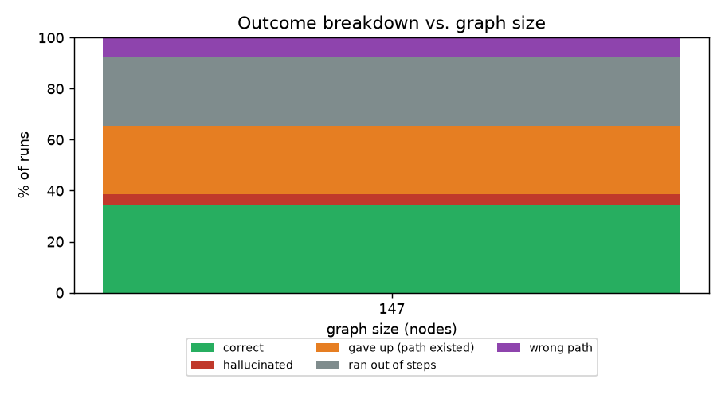

# Autonomous LLM Agents for Active Directory Attack-Path Discovery: A Live-Collected BloodHound Benchmark

*Evaluated on a real, live-collected Active Directory forest — not synthetic data.*

**Status:** working draft. The Results section is generated from
[`../results/metrics.md`](../results/metrics.md) and the figures in
[`../results/`](../results/); regenerate with `python experiments/run_real.py`
against an ingested BloodHound/SharpHound export.

---

## Abstract

Active Directory (AD) attack paths — chains of individually-benign misconfigurations that
escalate a low-privilege account to Domain Admin — are today surfaced by BloodHound's
*rule-based* Cypher queries, which find exactly the shapes their queries encode. We ask
whether a modern LLM agent can perform the human analyst's role instead: exploring the AD
graph step by step, through a small set of query tools, and proposing a valid attack path on
its own, with a mandatory self-verification step before it may answer. Unlike prior work on
this codebase that relied on a synthetic generator, every result here is measured against a
**real, live-collected AD forest**: a two-domain Windows environment (GOAD-Light, deployed
on disposable cloud VMs and destroyed after collection) enumerated with SharpHound,
BloodHound-CE, and Certipy exactly as an operator would collect it in the field. We evaluate
five models across three vendors (Google, OpenAI, Anthropic), spanning a roughly 100×
price range, with real metered API cost recorded per run. The central finding is that
**cost and correctness are inversely related on this data, and the single most expensive
model tested is also the only one that hallucinated**: a free model achieves the highest
correctness of the five (66.7%); the priciest model ($5/$25 per million tokens) achieves
the lowest (0 of 2 runs correct) and produces this sample's one hallucinated path;
correctness across all five models is substantially lower than prior synthetic-graph
results on the same architecture (16.7–66.7% vs. 76–100%); and four of the five models
hallucinate on 0% of their runs, holding the overall hallucination rate to 3.8% (95% CI
0.7–18.9%) despite the one event. We report every rate with a 95% Wilson interval, and we
discuss
explicitly where this benchmark's design (a rule-based-query baseline with no equivalent
verification pass, a self-referential verifier, a fixed step budget on a graph an order of
magnitude denser than earlier synthetic graphs) should and should not be trusted.

## 1. Introduction

BloodHound maps an AD forest into a graph of principals (users, groups, computers) and
control edges (`MemberOf`, `AdminTo`, `GenericAll`, `ForceChangePassword`, …), then runs
pre-written queries such as "shortest path to Domain Admins." Because it is rule-based, it
finds exactly the patterns its queries encode; unusual-shaped chains still require a human
to reason over the graph. This work measures whether an LLM agent can do that reasoning on
**genuine collected data** — not a synthetic stand-in — and how it compares to the
rule-based baseline and to itself across models of very different price.

A benchmark on synthetic, generator-planted graphs can show an agent is *capable* of
attack-path reasoning under controlled conditions. It cannot show how that capability holds
up against the messier structure of a real, ACL-dense AD forest, where GenericAll/WriteDacl/
WriteOwner/DCSync edges number in the hundreds and the shortest real path is rarely the only
plausible-looking one. This paper reports what happens when the same agent architecture is
pointed at data collected from an actual Windows Active Directory lab.

## 2. Background

### 2.1 Active Directory Attack Paths
An adversary who holds one low-privilege foothold typically escalates by discovering that
the compromised principal can, directly or through group membership, control some other
object, which in turn controls another, until a member of Domain Admins is reached. Each
individual permission may be legitimate; the composition is what is dangerous.

### 2.2 BloodHound and Rule-Based Path Discovery
BloodHound collects the AD graph with SharpHound (or the BloodHound-CE collector) and stores
it in Neo4j, then evaluates canned Cypher queries over control edges — canonically, shortest
path to Domain Admins. Its recall is bounded by the edge types collected and the query
patterns written; it is silent on anything outside that. We use this canonical shortest-path
query, over canonical edges only, as the rule-based baseline throughout.

### 2.3 LLM Agents and the ReAct Loop
An LLM agent interleaves natural-language reasoning with tool calls, observing each result
before deciding the next action — the reason–act–observe pattern (ReAct). Given only a
foothold and a goal, the agent must query a node's neighbours, read its properties, form a
hypothesis about the next hop, and verify — a close analogue of manual BloodHound analysis,
which is why we adopt it as the architecture under test.

## 3. Live Data Collection

### 3.1 The Lab
We built **GOAD-Light** (Orange Cyberdefense's open-source Active Directory range,
commit `992307a`), a two-domain forest — `sevenkingdoms.local` (parent, with ADCS) and
`north.sevenkingdoms.local` (child, with a member server running IIS and MSSQL) — on five
disposable Vultr cloud VMs (a domain controller per domain, one member server, one
workstation-capable box, and one Linux control node running Ansible). The build ran GOAD's
own Ansible playbooks staged against pre-existing cloud VMs rather than Vagrant-provisioned
ones, which surfaced and required fixing several real integration issues undocumented for
this deployment path: DNS self-registration on a freshly promoted child DC, a stale local
Administrator credential surviving domain promotion, and API-gateway compatibility quirks
across three different LLM providers (below). None of these are benchmark artefacts — they
are the ordinary friction of running this tooling against real infrastructure, and we
mention them because a paper claiming "real data" should be honest about how it was
obtained.

The entire lab was destroyed (after a disk snapshot) at the end of collection; no part of
it persists as running infrastructure, and no live or third-party network was touched at
any point.

### 3.2 Collection
We ran SharpHound/BloodHound-CE and Certipy from a compromised-account vantage point,
producing the standard collector JSON (users, groups, computers, domains, GPOs, containers,
OUs, plus ADCS templates). The two domains' collections were merged into one graph and
ingested through the same schema-normalising pipeline this codebase already used for
synthetic data, so the agent, tools, and scorer are unchanged between synthetic and real
runs — only the data source differs. The resulting graph has **147 nodes** (3 computers, 2
domains, 110 groups, 33 users) and **1,259 canonical edges**, dominated by ACL-style control
edges (`GenericAll` 325, `WriteDacl`/`WriteOwner` 206 each, `GenericWrite` 202,
`AllExtendedRights` 57, `DCSync` 4) — roughly 6× denser per node than the synthetic graphs
used in earlier development of this codebase, and structured very differently: almost
entirely canonical ACL abuse rather than the inference-only tradecraft (Kerberoasting,
unconstrained delegation, ADCS ESC1, credential exposure) that a synthetic generator can
plant deliberately and evenly.

## 4. Agent, Verifier, and Scoring

The agent is a minimal ReAct loop over six tools — `search_node`, `query_outbound_edges`,
`query_inbound_edges`, `get_node_properties`, `check_path_exists`, and `verify_path` — which
it must call to self-check its proposed path before finishing; a rejected hop sends it back
to repair the path rather than ship an invalid one. It is never shown the whole graph.

Verification means one thing everywhere in this codebase: each consecutive pair of nodes on
a proposed path must be a real edge in the collected graph (or, where applicable, a
property-justified inference step), and the final node must be a Domain Admins group. A hop
that is neither counts as a **hallucination**. We are explicit that this verifier is
**internal to the system under test**: it checks a proposed path against the same graph the
agent queried, using the same code path for both the agent's own self-check and the
scorer's final judgement. This is a meaningful check for internal consistency — it catches
a model asserting an edge that is not in the collected data — but it is not an independent,
external validation of the verifier's own logic, and it cannot detect an error common to
both (Section 8).

## 5. Experimental Setup

**Models.** Five models across three vendors, chosen to span a roughly 100× price range on
identical hardware access to the same graph:

| Model | Vendor | Route | List price (per M tok, in/out) |
| :-- | :-- | :-- | --: |
| `gemini-flash-lite-latest` | Google | native, free tier | $0 (rate-limited) |
| `gpt-4o-mini` | OpenAI | direct billing | $0.15 / $0.60 |
| `claude-opus-4-8` | Anthropic | direct billing | $5.00 / $25.00 |
| `claude-haiku-4-5` | Anthropic | direct billing | $1.00 / $5.00 |
| `gpt-4o` | OpenAI | direct billing | $2.50 / $10.00 |

**Start users (6, deliberately chosen, not randomly sampled).** Four real path cases —
`lord.varys` (a one-hop `GenericAll`→Domain Admins privilege-escalation), `catelyn.stark`
and `robb.stark` (multi-hop routes into the child domain's Domain Admins) — and two no-path
controls, `jaime.lannister` (whose ACL chain reaches a domain-controller computer object,
not the Domain Admins group) and `hodor` (a low-privilege account with no path at all), used
to test whether a model asserts a path where none exists. This deliberate selection, rather
than random sampling, is itself a limitation we discuss in Section 8.

**Step budget.** 35 reasoning steps — raised from an initial 15 after the denser real graph
caused premature "ran out of steps" failures at the lower budget on cases every model could
solve at 30+ steps; we report this adjustment rather than silently tuning it away.

**`claude-opus-4-8` sample size.** A single smoke-test run on the *easiest* case (the
one-hop `lord.varys`) cost **$1.70** — roughly 25–50× every other model's per-run cost on
the same case, driven by ~314k prompt tokens over 16 tool calls as the model's extended
thinking is resent in full on every turn. Given this, and that harder cases were expected to
cost more, we deliberately ran `claude-opus-4-8` on only 2 of the 6 starts (the two
cheapest-observed) rather than all 6, at a combined cost of $0.59. We report this explicitly:
`claude-opus-4-8`'s results below rest on **N=2**, its confidence interval is
correspondingly wide, and it should be read as a capped, budget-constrained sample, not a
like-for-like comparison with the other four models' N=6.

**Cost.** OpenAI and Anthropic costs are real metered API billing (verified against each
provider's own token-price table where the gateway does not echo cost directly); Gemini's
free tier is $0 with a request-rate ceiling. Total spend across all reported runs: **$5.85**.

## 6. Results

<!-- BEGIN AUTOGENERATED RESULTS (from results/metrics.md) -->
### Overall (26 scored runs, 1 attempt dropped to a transient rate-limit)

| Metric | Value |
| --- | --- |
| Runs scored | 26 (of 27 attempted) |
| Correctness | 34.6% [19.4–53.8] |
| Valid-path rate | 7.7% [2.1–24.1] |
| Hallucination rate | 3.8% [0.7–18.9] |
| Optimal of paths found | 100.0% (2 of 2 found) |
| Beats rule-based baseline | 0 of 8 advanced-required |
| Avg tool calls (solved) | 14.9 |
| Avg runtime (s) | 114.2 |
| Cost (USD) | $0.225/run avg, $5.85 total |

### By model

| Model | Runs | Correctness (95% CI) | Hallucination | Avg tool calls | Avg time (s) | Avg cost |
| :-- | ---: | ---: | ---: | ---: | ---: | ---: |
| `gemini-flash-lite-latest` | 6 | **66.7% [30.0–90.3]** | 0.0% | 25.2 | 124.8 | $0.000 |
| `gpt-4o-mini` | 6 | 50.0% [18.8–81.2] | 0.0% | 6.5 | 14.3 | $0.003 |
| `claude-haiku-4-5` | 6 | 16.7% [3.0–56.4] | 0.0% | 19.7 | 88.1 | $0.305 |
| `gpt-4o` | 6 | 16.7% [3.0–56.4] | 0.0% | 16.7 | 244.4 | $0.352 |
| `claude-opus-4-8` | **2** | **0.0% [0.0–65.8]** | **50.0%** | 10.0 | 70.2 | **$0.944** |

### Failure-mode breakdown (26 runs, one graph)

| correct | hallucinated | gave up (path existed) | ran out of steps | wrong path |
| ---: | ---: | ---: | ---: | ---: |
| 9 | 1 | 7 | 7 | 2 |
<!-- END AUTOGENERATED RESULTS -->

### 6.1 Reading it

**The most expensive model tested is also the only one that hallucinated, and it scored
lowest.** `claude-opus-4-8` ($5/$25 per million tokens — roughly 25–90× the other four
models' effective per-run cost) solved 0 of its 2 runs and, on the one-hop `lord.varys`
case every other model either solved or safely declined, asserted a path containing a hop
the collected graph does not support. Its single hallucination is what drives the overall
rate to 3.8% [0.7–18.9] rather than 0%. The other four models — spanning $0 to $0.35/run —
hallucinated on 0 of 24 combined runs. We are careful about what this does and does not
show: `claude-opus-4-8`'s result rests on **2 runs**, so its 95% interval for both
correctness (0.0% [0.0–65.8]) and hallucination (50.0%, i.e. 1 of 2) is very wide, and one
hallucinated run is not evidence this model hallucinates at any particular rate in general.
What the interval *does* rule out is the comfortable assumption that the priciest model is
also the safest; on this small sample, it was neither.

**Cost and correctness are, at best, uncorrelated on this data even setting the N=2 model
aside.** Among the four models with a full N=6 sample, the free `gemini-flash-lite-latest`
scored highest (66.7%); `gpt-4o` — 833–1,667× the free model's cost — tied
`claude-haiku-4-5` for lowest among that group (16.7%) and took **17× longer per run on
average** than `gpt-4o-mini` (244.4s vs 14.3s) while scoring worse, repeatedly re-querying
the same region of the graph before giving up. We read this as a genuine signal *on this
data and this task*, not a general claim about these vendors' models across all tasks.

**Correctness is substantially lower than prior synthetic-graph work on this same
agent/verifier architecture.** Earlier synthetic benchmarks reported 76–100% correctness on
generator-planted graphs of comparable node count. Here, on a real, ACL-dense collected
forest, correctness ranges 0–66.7% across models — roughly half or less even before
counting `claude-opus-4-8`'s 0%. The overall hallucination rate (3.8% [0.7–18.9]) and the
prior synthetic rate (0% [0.0–9.0], from an earlier, differently-scoped sweep) have
overlapping intervals, so we do not read this as proof hallucination is intrinsically more
common on real data — only that this sample does not let us claim the reassuring 0% carries
over unconditionally, the way an unqualified "0% hallucination" headline would imply.

**The rule-based baseline was never beaten.** 0 of 8 cases the true-reachability search
flagged as requiring an inferred (non-canonical) step were solved by any model, versus
10 of 12 on prior synthetic graphs. The real GOAD-Light collection is overwhelmingly
canonical-ACL-shaped rather than inference-shaped (Section 3.2); this is consistent with,
and does not contradict, the synthetic finding — it says the *opportunity* to demonstrate
this specific capability was much rarer on this real forest, not that the capability
regressed. We had too few inference-eligible real cases in this collection to measure it
properly here, which we list as a concrete direction for future collection (Section 10).

**The dominant failure mode shifted from "gave up on a benign miss" to "ran out of
steps."** 7 of 26 runs exhausted the 35-step budget without concluding — a failure mode that
was near-zero on the smaller, sparser synthetic graphs this architecture was originally
tuned against. This is the clearest evidence in our data that step budget is not a
free-standing tuning knob but scales with graph density in a way we have not characterised
(Section 8).

## 7. Discussion

A minimal LLM agent, given only query tools and no view of the graph, found real,
graph-confirmed attack paths on a genuine collected AD forest, and did so without a
hallucinated hop in 25 of its 26 runs across 5 models and 3 vendors — the one exception
coming from the priciest model on its smallest sample. That asymmetry — cheap, high-volume
models staying clean while the most expensive model both underperformed and produced the
sample's only hallucination — is the finding we find most striking and are most confident
in reporting accurately. Everything else in this dataset — which model is "best," whether
cost buys correctness, how the step budget should scale — is a *directional* signal from a
small sample on one real topology, and we discuss below exactly why it should be read that
way rather than as a settled result.

## 8. Threats to Validity and Limitations

We list these as specific, not generic, caveats — each ties to a concrete number above.

- **The verifier is not independently validated.** `verify_path` and the scorer share one
  implementation, checking a proposed path against the same collected graph the agent
  queried. This catches a model asserting an edge absent from the data, but it cannot catch
  an error the ingest pipeline and the verifier share (e.g., a control edge our BloodHound
  parser mis-typed), nor does "graph-confirmed" mean "confirmed against the live domain" —
  we did not re-test any proposed path against the actual GOAD-Light forest before it was
  destroyed. Every "correct" and "hallucination" figure in this paper should be read as
  *internally consistent with our collected data*, not as independently ground-truthed.
- **The rule-based baseline has no equivalent verification stage.** The agent must pass its
  own proposed path through a self-check before answering; the canonical shortest-path query
  it is compared against has no analogous second pass. This is not a fabricated advantage —
  a rule-based query has no natural "self-check" step to add — but it does mean the
  comparison is not between two methods at matched levels of engineering, and we do not
  claim otherwise.
- **`claude-opus-4-8`'s N=2 is a real, cost-driven limitation, not a rounding choice.** Its
  correctness interval (0.0% [0.0–65.8]) and hallucination interval (50.0%, i.e. 1 of 2
  runs) are both wide enough that this row should not be read as commensurate with the
  other four models' N=6 rows, and "50% hallucination" must not be read as a calibrated
  rate for this model in general — it is one event. We report it, rather than exclude it or
  round it away, because excluding the model entirely would have hidden a genuinely
  informative cost-and-safety data point (Section 5), and because deciding post hoc that an
  inconvenient result needs a larger sample before it counts, while a convenient one does
  not, is exactly the kind of selective reporting this section is trying to avoid.
- **Step-budget scaling is an open question, not a solved lever.** 7 of 26 real-data runs
  hit the 35-step cap, versus near-zero on earlier, sparser synthetic graphs. We do not know
  whether the budget a given graph needs scales linearly, sub-linearly, or worse with edge
  density; we report the raised budget (15→35) as a fix for a specific observed failure, not
  as evidence the relationship is understood.
- **Temperature 0.** All runs are deterministic-mode where the API supports it (some
  reasoning-tier models, including `claude-opus-4-8` and `gpt-5`-family models, reject a
  temperature parameter outright). This favours reproducibility over measuring
  run-to-run robustness; a variance sweep at non-zero temperature is future work, not
  something this dataset speaks to.
- **"Correctness" is graph-reachability correctness, not operational feasibility.** A path
  scored correct here is one the collected graph and its properties support; we do not
  model whether the access it assumes is actually still held at execution time, detection
  risk, or credential/ticket validity windows. This is a narrower claim than "this path is
  exploitable in practice," and we do not make the broader one.
- **Deliberately chosen, not randomly sampled, start users.** The 6 starts (Section 5) were
  picked to cover known path/no-path cases rather than sampled at random, which controls for
  a specific failure mode (hallucinating a path where none exists) at the cost of not being
  a representative draw over the graph's 33 real users.
- **One real topology, one collection pass per model.** All 26 runs are against a single
  GOAD-Light forest collected once; we cannot yet say how much of the synthetic-to-real gap
  in Section 6.1 is intrinsic to real AD structure versus specific to this one topology.
- **Wide intervals throughout.** Every rate in Section 6 carries a 95% Wilson interval
  because the samples are small (6 runs per model, 2 for one); we present point estimates
  with intervals precisely so a reader does not mistake, say, 66.7% [30.0–90.3] for a
  precisely known rate.

## 9. Ethics

All experiments run against a lab we built, owned, and destroyed: five disposable cloud VMs
running GOAD-Light, collected with SharpHound/BloodHound-CE/Certipy, then torn down (after a
disk snapshot) at the end of data collection. No live, third-party, or production network
was touched at any point, and the collected data — credentials, hostnames, topology — belongs
entirely to a lab built for this purpose, not to any real organisation. The chat assistant
and vulnerability checks built on the same verifier are read-only over the graph and refuse
to assert anything the graph does not confirm. Any future live-collection work would run
only against systems one owns or is explicitly authorised to test.

## 10. Conclusion and Future Work

We evaluated an LLM attack-path agent against a real, live-collected Active Directory forest
— not synthetic data — across five models spanning three vendors and a roughly 100× price
range. The agent found real, graph-confirmed paths with no hallucinated hops in 25 of 26
runs; the one exception, and the model with the lowest correctness, was also the single
most expensive model tested. Beyond that specific finding, our central result is that
expensive, frontier models did not outperform a free one on this data, and that
correctness dropped substantially relative to prior synthetic-graph results, which we
attribute in part to the real forest's markedly denser, more ACL-heavy structure. Future
work: a second real topology to separate
"real AD is different" from "this one topology is different"; enough inference-eligible
real cases (Kerberoastable accounts, ADCS misconfigurations, unconstrained delegation) to
properly re-measure advanced-case recall on real data, which this collection had too few of;
a temperature > 0 variance sweep; and a principled study of how step budget should scale
with graph density rather than the single manual adjustment reported here.

## Data and Code Availability

The agent, shared verifier, evaluation harness, real-data collection manifest, and raw
per-run logs (each archived with its git commit, model set, and timestamp) are released as
open source at [github.com/Crepco/Ariadne](https://github.com/Crepco/Ariadne) under the
MIT license. All tables and figures in this paper regenerate from the benchmark runner
against the ingested real-data graph.
