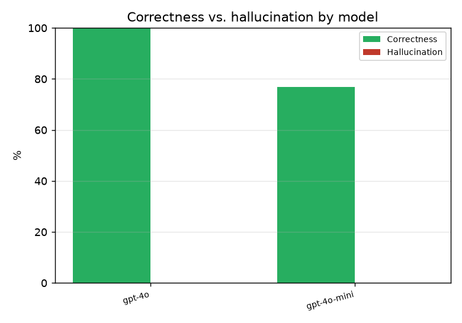

# Autonomous LLM Agents for Active Directory Attack-Path Discovery

*A reproducible, no-Windows benchmark on synthetic BloodHound graphs.*

**Status:** working draft. The Results section is generated from
[`../results/metrics.md`](../results/metrics.md) and the figures in
[`../results/`](../results/); regenerate them with
`python experiments/run_benchmark.py`.

---

## Abstract

Active Directory (AD) attack paths — chains of individually-benign misconfigurations
that escalate a low-privilege account to Domain Admin — are today surfaced by
BloodHound's *rule-based* Cypher queries. We ask whether a modern LLM agent can perform
the human analyst's role instead: exploring the AD graph step by step, through a small set
of query tools, and proposing a valid attack path on its own. We evaluate on synthetic
graphs that conform to the BloodHound schema, which lets us control graph size and compute
exact ground truth. We report path-correctness, hallucination rate, tool-call efficiency,
time-to-solution, and how these scale with graph size, all against the BloodHound-equivalent
shortest-path baseline.

## 1. Introduction

BloodHound maps an AD forest into a graph of principals (users, groups, computers) and
control edges (`MemberOf`, `AdminTo`, `GenericAll`, `ForceChangePassword`, …), then runs
pre-written queries such as "shortest path to Domain Admins." Because it is rule-based, it
finds exactly the patterns its queries encode; unusual-shaped chains still require a human
to reason over the graph. This work measures whether an LLM agent can do that reasoning, and
how it compares to the rule-based baseline on identical data.

## 2. Method

- **Data.** A seeded generator (`seed=1337`) writes a structurally realistic AD graph into
  Neo4j — no Windows lab; the same pipeline also ingests a real BloodHound/SharpHound
  export (or a round-trip export of the synthetic graph, for a safe end-to-end sample). Six
  known chains are *planted*: two canonical (`ForceChangePassword→MemberOf→GenericAll`,
  `GenericWrite→AddMember→MemberOf`) and four that require an *inferred* step (kerberoast a
  host-exposed crackable account; abuse an unconstrained-delegation host; forge a certificate
  via an ADCS ESC1 template; read an account's leaked credentials off a host).
- **Agent.** A minimal ReAct loop (reason → act → observe) with six tools: `search_node`,
  `query_outbound_edges`, `query_inbound_edges`, `get_node_properties`, `check_path_exists`,
  and `verify_path` — which it must call to self-check its proposed path before finishing, so
  a rejected hop sends it back to repair the path rather than shipping an invalid one. It is
  never shown the whole graph — it must explore.
- **Edges vs. inference.** The graph contains only *canonical* BloodHound edges — what the
  classic shortest-path query traverses. Advanced tradecraft is **not** an edge: it is
  derived from node **properties** (`hasspn`+`crackable`+`roastable_target`,
  `unconstraineddelegation`, `esc1`, `cred_target`) by inference rules. So a canonical query
  *structurally* cannot follow those steps, whereas an agent that reads the properties can —
  and the step is accepted only if a property justifies it.
- **Baselines (ground truth).** TRUE reachability is BFS over canonical edges **plus**
  property-inferred jumps; the **BloodHound-equivalent** baseline is the canonical-only
  Cypher `shortestPath`. When the agent's verified path uses an inferred step and the
  canonical query finds none, it is credited `beats_bloodhound` — a *structural* gap, not a
  filter choice, since the inferred step is not an edge that could be added back.
- **Scoring / verifier.** Each hop must be a real canonical edge **or** a property-justified
  inferred step reaching Domain Admins; anything else is a hallucination. The same verifier
  backs a vulnerability-check catalog and a grounded chat assistant that refuse to assert
  any path or finding the graph does not confirm.

## 3. Experimental setup

- **Models:** `openai/gpt-4o-mini` and `openai/gpt-4o` via OpenRouter, temperature 0. The
  model set and sampling temperature are configurable (`--models`, `--temperature`) for
  multi-model and variance/CI sweeps.
- **Graph sizes:** swept across several node counts to produce a scaling curve.
- **Starts per graph:** the planted-chain users plus N random users (some unreachable, to
  test whether the agent hallucinates a path where none exists).
- **Reproduce:** `python experiments/run_benchmark.py` → writes
  `experiments/logs/results.csv`, `results/*.png`, and `results/metrics.md`.

## 4. Results

<!-- BEGIN AUTOGENERATED RESULTS (from results/metrics.md) -->
_Sweep: `openai/gpt-4o-mini` + `openai/gpt-4o` via OpenRouter, 37 scored runs across 2
graph sizes, 13 starts each (10 planted + 3 random), temperature 0, 20-step budget with
mandatory self-verification. Advanced steps are inferred from node properties, not edges._

### Overall

| Metric | Value |
| --- | --- |
| Runs | 37 |
| Correctness | 83.8% |
| Valid-path rate | 81.1% |
| Hallucination rate | 0.0% |
| Optimal of paths found | 100.0% (30 found) |
| Beats BloodHound | 10 of 12 advanced-required |
| Advanced-case recall | 83.3% (10/12) |
| Avg tool calls (solved) | 5.13 |
| Avg runtime (s) | 24.87 |
| Agent misses (of truly reachable) | 6/36 |
| Cost (USD) | $0.0104/run, $0.3838 total |

### By model

| Model | Runs | Correctness | Hallucination | Beats BH | Avg tool calls | Avg time (s) | Avg cost |
| :-- | ---: | ---: | ---: | ---: | ---: | ---: | ---: |
| openai/gpt-4o | 11 | 100.0% | 0.0% | 4 | 5.2 | 16.81 | $0.0306 |
| openai/gpt-4o-mini | 26 | 76.9% | 0.0% | 6 | 6.7 | 28.28 | $0.0018 |

### Scaling by graph size

| Nodes | Runs | Correctness | Hallucination | Beats BH | Avg tool calls | Avg time (s) |
| ---: | ---: | ---: | ---: | ---: | ---: | ---: |
| 222 | 24 | 87.5% | 0.0% | 7 | 6.1 | 21.47 |
| 487 | 13 | 76.9% | 0.0% | 3 | 6.4 | 31.16 |

**Reading it.** Three points. (1) **The agent beats the rule-based baseline where the step
is inferred, not traversed.** Of the 12 cases reachable only through a property-inferred
step, it found a real path **10 times — 83% advanced-case recall** (up from 33% before
self-verification), spanning all four inference primitives: kerberoast, unconstrained
delegation, ADCS ESC1, and credential exposure. These are steps the canonical query cannot
follow at all, since they are not edges in the graph. (2) **Self-verification eliminated
hallucinations.** Requiring the agent to run its proposed path through `verify_path` before
finishing drove the hallucination rate to **0%** and repaired the multi-hop kerberoast
chain it previously failed by dropping the roasted-account node — a rejected hop now sends
it back to fix the path instead of shipping an invalid one. Every real path found is the
shortest (30/30 optimal), and step-exhaustion is 0 in the failure breakdown; the residual
misses are the agent conservatively declaring "no path" on a few reachable cases. (3) **The
stronger model helps where budget allows.** `gpt-4o` solved **100%** of the runs it
completed vs **77%** for `gpt-4o-mini`, at ~17× the per-run cost.

_Caveats._ `gpt-4o`'s sample is small and capped by budget: 15 of its 26 attempts were
dropped as OpenRouter credit/rate-limit errors (excluded as infrastructure failures, not
counted as misses), so read its 100% as a capped-N signal, not a calibrated rate. The
advanced-case rate depends on how many inference-only routes the graph contains, so treat
it as a demonstration of capability, not a calibrated frequency.
<!-- END AUTOGENERATED RESULTS -->

## 5. Limitations

- Inference rules are modelled abstractly (a property + a rule stands in for "roast this
  SPN and crack it offline", or "coerce and impersonate via unconstrained delegation"), not
  simulated at protocol fidelity. They are deliberately kept *local* (you must reach the
  exposing host first) so the benchmark stays discriminating; the "beats BloodHound" rate
  therefore depends on how many inference-only routes the graph contains.
- On real BloodHound data the kerberoast pivot is global (any user can roast any SPN), so
  `crackable`/`roastable_target` are set by a documented heuristic at ingest; the cleanly
  measured inference case is strongest on the synthetic generator.
- Modest sample: 37 scored runs over two models and two graph sizes at temperature 0 (no
  repeated trials, so no confidence intervals yet), and `gpt-4o`'s N is further reduced by
  OpenRouter credit limits. The §4 tables regenerate from `experiments/run_benchmark.py`, so
  a larger multi-trial variance sweep (`--trials` with `--temperature`) or more models via
  `--models` drop in directly.

## 6. Ethics

Experiments use synthetic, locally-generated data (or a BloodHound export of a system one
owns). No live network is involved in the benchmark. The chat assistant and checks are
read-only over the graph and refuse to assert anything the graph does not confirm. Any
live-collection step would only ever run against an environment one owns or is explicitly
authorised to test.

## 7. Future work

Validation on more live-collected AD data; larger graphs and a confidence-interval sweep
(repeated trials at temperature > 0 across more models); further inference rules and
vulnerability checks (ACL-based DCSync chains, more ADCS/ESC variants); and a study of the
chat assistant's triage quality against analyst judgement.
